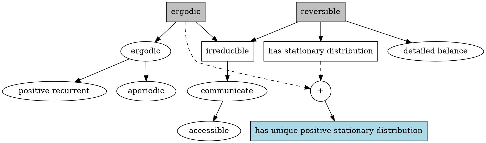

## Sampling is difficult.

A general sampling method I can think of.

- find CDF by integrating PDF from $-\infty$ to x.
- find inverse function of CDF.
- take a sample from uniform distribution and put the value in the function found.


It's more difficult when it comes to high dimensions.

### If it were easy it would have been great

If it were easy to sample always, we could easily find global maximum
$$\max_x f(x)$$
just by taking samples from $$\lim_{K \to \infty}e^{Kf(x)}$$.

(Frequently, PDF we have is not normalized.)

#### For example

$$
f(x) = -(x-1)^2(x+1)^2 + 1 + 0.05x^3
$$

$$
e^{Kf(x)} = e^{K(-(x-1)^2(x+1)^2 + 1 + 0.05x^3)}
$$

| $K = 1$  | $K = 5$  | $K = 10$|
| -------- | -------- | ------- |
||||

## Sampling is useful

We can calculate expectation values by sampling.

$$\int f(x)p(x) dx \approx \sum_{i=1}^{N} {f(X_i) \over N} $$

## Naive sampling

```py
import numpy as np
import seaborn as sns
import math
from scipy.stats import multivariate_normal

def easy_p(x):
    mean1 = np.array([1, 1])
    cov1 = np.array([[1, 0], [0, 1]])
    mean2 = np.array([3, 4])
    cov2 = np.array([[1, 0], [0, 1]])
    return (4 * multivariate_normal.pdf(x, mean=mean1, cov=cov1) + 1 * multivariate_normal.pdf(x, mean=mean2, cov=cov2))/5

def naive_sample_from_easy_p(iter):
    mean1 = np.array([1, 1])
    cov1 = np.array([[1, 0], [0, 1]])
    mean2 = np.array([3, 4])
    cov2 = np.array([[1, 0], [0, 1]])
    samples = np.zeros((iter, 2))
    for i in range(iter):
        if np.random.rand() < 4/5:
            x_star = multivariate_normal.rvs(mean=mean1, cov=cov1)
        else:
            x_star = multivariate_normal.rvs(mean=mean2, cov=cov2)
        samples[i] = x_star
    return np.array(samples)

samples = naive_sample_from_easy_p(1500)
sns.jointplot(samples[:, 0], samples[:, 1])
print(samples.shape)
```

```txt
(1500,2)
```


## Rejection sampling

```py
import numpy as np
import seaborn as sns
import math
from scipy.stats import multivariate_normal

def easy_p(x):
    mean1 = np.array([1, 1])
    cov1 = np.array([[1, 0], [0, 1]])
    mean2 = np.array([3, 4])
    cov2 = np.array([[1, 0], [0, 1]])
    return (4 * multivariate_normal.pdf(x, mean=mean1, cov=cov1) + 1 * multivariate_normal.pdf(x, mean=mean2, cov=cov2))/5

def difficult_and_not_normalized_p(x):
    rSquare = (x[0]-2)**2 + (x[1]-3)**2
    return 0 if rSquare > 3**2 else easy_p(x)

def rejection_sample(f, iter):
    proposal_mean = np.array([2.1, 3.1])
    proposal_cov = np.array([[3, 0],[0, 3]])
    samples = []
    m = 10
    for i in range(iter):
        x_star = multivariate_normal.rvs(mean = proposal_mean, cov = proposal_cov)
        criteria = f(x_star)/(m * multivariate_normal.pdf(x_star, mean = proposal_mean, cov = proposal_cov))
        if criteria > 1:
            # proposal distribution is not enveloping the target distribution
            # increase m
            print(criteria)
        elif np.random.rand() < criteria:
            samples.append(x_star)
    return np.array(samples)

samples = rejection_sample(difficult_and_not_normalized_p, 10000)
sns.jointplot(samples[:, 0], samples[:, 1])
print(samples.shape)
```

```txt
(760, 2)
```


### If the proposal distribution is not enveloping the target distribution efficiently

```py
import numpy as np
import seaborn as sns
import math
from scipy.stats import multivariate_normal

def easy_p(x):
    mean1 = np.array([1, 1])
    cov1 = np.array([[1, 0], [0, 1]])
    mean2 = np.array([3, 4])
    cov2 = np.array([[1, 0], [0, 1]])
    return (4 * multivariate_normal.pdf(x, mean=mean1, cov=cov1) + 1 * multivariate_normal.pdf(x, mean=mean2, cov=cov2))/5

def difficult_and_not_normalized_p(x):
    rSquare = (x[0]-2)**2 + (x[1]-3)**2
    return 0 if rSquare > 3**2 else easy_p(x)

def rejection_sample(f, iter):
    proposal_mean = np.array([3, 3])
    proposal_cov = np.array([[1, 0],[0, 1]])
    samples = []
    m = 500
    for i in range(iter):
        x_star = multivariate_normal.rvs(mean = proposal_mean, cov = proposal_cov)
        criteria = f(x_star)/(m * multivariate_normal.pdf(x_star, mean = proposal_mean, cov = proposal_cov))
        if criteria > 1:
            # proposal distribution is not enveloping the target distribution
            # increase m
            print(criteria)
        elif np.random.rand() < criteria:
            samples.append(x_star)
    return np.array(samples)

samples = rejection_sample(difficult_and_not_normalized_p, 50000)
sns.jointplot(samples[:, 0], samples[:, 1])
print(samples.shape)
```

```txt
(79, 2)
```


## Relationship of sampling methods


## Metropolis-Hastings algorithm

```py
import numpy as np
import seaborn as sns
import math
from scipy.stats import multivariate_normal

def easy_p(x):
    mean1 = np.array([1, 1])
    cov1 = np.array([[1, 0], [0, 1]])
    mean2 = np.array([3, 4])
    cov2 = np.array([[1, 0], [0, 1]])
    return (4 * multivariate_normal.pdf(x, mean=mean1, cov=cov1) + 1 * multivariate_normal.pdf(x, mean=mean2, cov=cov2))/5

def difficult_and_not_normalized_p(x):
    rSquare = (x[0]-2)**2 + (x[1]-3)**2
    return 0 if rSquare > 3**2 else easy_p(x)

def metropolis_hastings(f, iter):
    x = np.array([4., 1.])
    proposal_cov = np.array([[0.5, 0],[0, 0.5]])
    burn_in = 200
    samples = np.zeros((iter, 2))

    for i in range(iter + burn_in):
        x_star = multivariate_normal.rvs(mean=x, cov=proposal_cov)

        a = f(x_star) / f(x)

        # This line can be skipped since the propsed transition probability is symmetric.
        a *= multivariate_normal.pdf(x, mean=x_star, cov=proposal_cov) / multivariate_normal.pdf(x_star, mean=x, cov=proposal_cov)

        if np.random.rand() < a:
            x = x_star
        if i >= burn_in:
            samples[i - burn_in] = x
    return samples

samples = metropolis_hastings(difficult_and_not_normalized_p, 2000)
sns.jointplot(samples[:, 0], samples[:, 1])
print(samples.shape)
```

```txt
(79, 2)
```


### About Markov chain

Try it!

[http://markov.yoriz.co.uk/](http://markov.yoriz.co.uk/)

### To be a good Markov chain to sample from



- A circle is a property of a state.
- A box is a property of a Markov chain.

### Derivation of MH algorithm

#### Goal

Design a markov chain that has a stationary distribution $\pi(x) = P(x)$ and the stationary distribution is unique.

#### How

##### Propose transition(conditional) probabilities

$P(x^\prime \mid x_t) = g(x^\prime \mid x_t) \cdot A(x^\prime, x_t)$

- $g(x^\prime\mid x_t)$ is any proposal distribution chosen.
- $A(x^\prime,x_t)=\min \left(1,{\frac {P(x^\prime)}{P(x_{t})}}{\frac {g(x_{t}\mid x^\prime)}{g(x^\prime\mid x_{t})}}\right)$ is acceptance probability.

##### Show that the markov chain is reversible

proof.

Because either $A(x^\prime,x)$ or $A(x^\prime,x)$ will be 1, the equation below holds.

$$
{\frac {A(x^\prime,x)}{A(x,x^\prime)}}={\frac {P(x^\prime)}{P(x)}}{\frac {g(x\mid x^\prime)}{g(x^\prime\mid x)}}
$$

By multiplying denominators and the both side of equation, we have

$$
g(x^\prime\mid x_t) \cdot A(x^\prime,x_t) = g(x_t, x^\prime) \cdot A(x_t, x^\prime)
$$.

Then,

$$
P(x^\prime\mid x)P(x) = P(x\mid x^\prime)P(x^\prime)
$$.

Now we showed the detailed balance property for each transition probability.

So, by definition, the markov chain is reversible, thus, it has a stationary distribution.

##### Show that it is also ergodic

I couldn't find the proof, but they looks trivial for the markov chain with discrete states.

- The markov chain we made is positive recurrent.
  - The expected return time of state $i$ is finite.
- The markov chain we made is aperiodic.
  - We can make infinitely many paths returning to the same state that the number of steps is not periodic with any positive integer which is greater than 1.

By definition it is ergodic.

## References

- [https://www.youtube.com/playlist?list=PLD0F06AA0D2E8FFBA](https://www.youtube.com/playlist?list=PLD0F06AA0D2E8FFBA)
- [http://www.secmem.org/blog/2019/01/11/mcmc/](http://www.secmem.org/blog/2019/01/11/mcmc/)
- [http://markov.yoriz.co.uk/](http://markov.yoriz.co.uk/)
- [https://en.wikipedia.org/wiki/Markov_chain](https://en.wikipedia.org/wiki/Markov_chain)
- [https://en.wikipedia.org/wiki/Metropolis%E2%80%93Hastings_algorithm](https://en.wikipedia.org/wiki/Metropolis%E2%80%93Hastings_algorithm)
- [https://en.wikipedia.org/wiki/Gibbs_sampling](https://en.wikipedia.org/wiki/Gibbs_sampling)
- [https://stats.stackexchange.com/questions/185631/what-is-the-difference-between-metropolis-hastings-gibbs-importance-and-rejec](https://stats.stackexchange.com/questions/185631/what-is-the-difference-between-metropolis-hastings-gibbs-importance-and-rejec)
- [https://www.youtube.com/playlist?list=PLt9QR0WkC4WVszuogbmIIHIIQ2RMI78RC](https://www.youtube.com/playlist?list=PLt9QR0WkC4WVszuogbmIIHIIQ2RMI78RC)
- [https://brilliant.org/wiki/stationary-distributions/](https://brilliant.org/wiki/stationary-distributions/)
- [https://brilliant.org/wiki/ergodic-markov-chains/](https://brilliant.org/wiki/ergodic-markov-chains/)
- [https://www.researchgate.net/figure/Illustration-of-Metropolis-Hastings-M-H-algorithm-explained-in-Figure-1_fig8_279248766](https://www.researchgate.net/figure/Illustration-of-Metropolis-Hastings-M-H-algorithm-explained-in-Figure-1_fig8_279248766)
